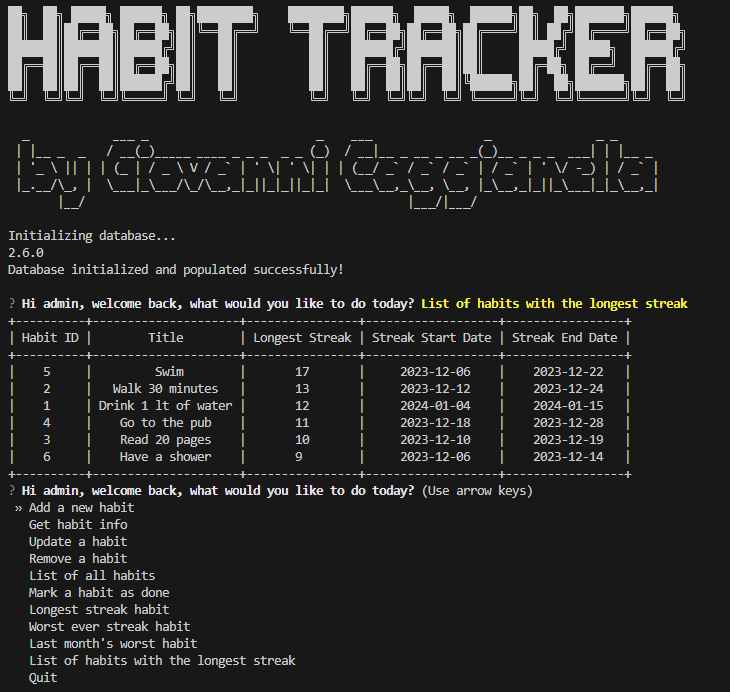

# Habit Tracker App

The Habit Tracker App is a Python-based application designed to help users track and manage their habits over time. It features a simple interface for tracking habits, types, and entries, alongside analytics to review progress.



## Installation and Running

### 1.1. Installation

#### Prerequisites:
- Git
- Python

#### Steps:

1. **Clone the repository:**
    Open Git Bash in your desired folder and execute the following command:
    ```bash
    git clone https://github.com/GiovanniCaggianella/habit-tracker-app.git
    git checkout master
    ```

2. **Install Python:**
    Download and install Python from the [official website](https://www.python.org/).

3. **Install Dependencies:**
    Open a shell in the directory where you forked the project and execute the following commands:
    ```bash
    pip install questionary prettytable sqlalchemy pytest matplotlib
    ```

### 1.2. Configuration

Upon running, the app will automatically populate with predefined data for demonstration purposes:

- **Admin User**: One admin user is automatically logged in.
- **Habits**: Six habits are preloaded.
- **Habit Types**: Two habit types are available.
- **Entries**: 300 random habit tracking entries, dated from December 1, 2023, to the day before the current date.

**Database Initialization**:
To initialize the database with the predefined data:
```python
init_db() # Initializes the database. Comment out if you wish to retain data between sessions.
user_logged_in = 1 # The user ID for the admin user.
```

### 1.3. Start & Run

To launch the application, you have two options:

1. **Via Command Line:**
   - Open a command line interface (CLI) and navigate to the project directory.
   - Execute the application by running:
     ```bash
     python .\main.py
     ```

2. **Direct Execution:**
   - Navigate to the project directory using your file explorer.
   - Double-click on the `main.py` file to start the application.

### 1.4. Unit Tests

The application includes a suite of unit tests designed to ensure the functionality works as expected. Specifically, mock data for the habit "Drink Water" is provided within `session_mock` to facilitate these tests.
To execute the unit tests, follow these steps:

1. Open a command line interface (CLI) and navigate to the project directory.
2. Run the tests by executing the following command:
   ```bash
   pytest
   ```
